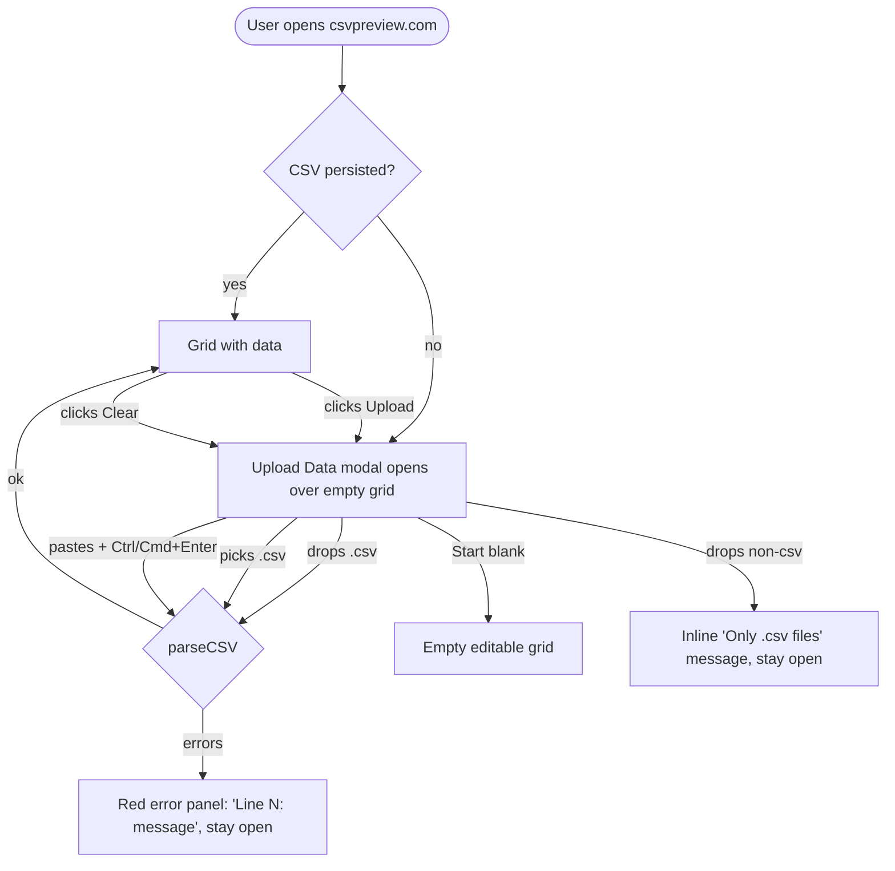

## Product objectives

From [specs/v0.1/user_stories.md](specs/v0.1/user_stories.md) (Stories 1 & 2) and wireframe [specs/v0.1/wireframes/1A_empty_state_with_upload_modal.png](specs/v0.1/wireframes/1A_empty_state_with_upload_modal.png):

1. **Get a CSV into the app in ≤2 clicks.** On first load the user should immediately see the Upload dialog over the empty grid — no hunting for a button.
2. **Three ingest paths, equal weight.**
  - Drag-and-drop a `.csv` file onto the modal.
  - Click to pick a `.csv` via the native file dialog.
  - Paste CSV text directly.
3. **Help me when my CSV is broken.** If parsing fails, show the *exact* line number and a readable message inside the modal; do not close the modal or discard what the user just tried.
4. **Don't force me to upload.** A user who just wants to type into a blank sheet can skip the upload step with one click.
5. **Let me swap CSVs later.** When a CSV is already loaded, a visible Upload affordance re-opens the same modal. Uploading replaces the current data.
6. **Match wireframe 1A** visually and in copy: title "Upload Data", dashed drop zone, paste textarea, parse-error panel at the bottom, close button top-right.

All behavior below exists to serve these objectives.

---

## User flows




---

## Delivery surface

### New / changed UI


| Surface               | What the user sees                                                                                                                                     |
| --------------------- | ------------------------------------------------------------------------------------------------------------------------------------------------------ |
| Modal header          | "Upload Data" + close (×)                                                                                                                              |
| Drop zone             | Dashed bordered region saying "Drag a .csv file anywhere in this area" with a prominent "Accepts: .csv files only" button that opens the native picker |
| Paste area            | Textarea with "Paste your CSV content here… (Ctrl+V)" placeholder; Ctrl/Cmd+Enter submits                                                              |
| Start-blank CTA       | Footer button **Start with a blank sheet** — closes the modal, user lands on an empty editable grid                                                    |
| Error panel           | Red-bordered list shown only when parsing produced errors, each row reads `Line {n}: {message}`                                                        |
| Top bar (data loaded) | New **Upload** button reopens the modal; existing Clear button still present                                                                           |
| Top bar (empty state) | Upload button still present, though modal is already open                                                                                              |


Copy and layout follow wireframe 1A. The only addition vs the wireframe is the **Start with a blank sheet** CTA, introduced to satisfy objective #4.

### Acceptance checklist (manual walkthrough)

- First visit (empty localStorage) → modal is visible over the grid.
- Drop a valid `.csv` → modal closes, grid populates, data survives page reload.
- Drop a non-csv (e.g. `.txt`) → inline "Only .csv files are accepted", modal stays open, nothing ingested.
- Pick a valid `.csv` via the CTA button → same as drop.
- Paste valid CSV, press Ctrl/Cmd+Enter → modal closes, grid populates.
- Paste malformed CSV (`"unclosed`) and submit → error panel shows `Line 1: …`, modal stays open, previous data (if any) untouched.
- Click **Start with a blank sheet** → modal closes, empty grid ready for typing.
- With data loaded, click top-bar Upload → modal opens; submitting a new CSV replaces current data.
- Click Clear → localStorage cleared, modal reopens.
- Press Escape → modal closes (equivalent to Cancel).

---

## Technical approach

A small set of conventions is applied consistently across the two components involved:

### 1. Separation of business logic and rendering, per component

Every non-trivial component is a pair of files: a hook that owns state & handlers, and a `.tsx` file that only renders. This lets us test behavior without rendering and keeps JSX readable.

### 2. Co-located component folders

Each component gets its own folder. `hooks.ts` and `ComponentName.tsx` live side by side — no global `app/hooks/` directory.

```
app/components/
  UploadModal/
    UploadModal.tsx     ← JSX + linaria styles
    hooks.ts            ← useUploadModal
    index.ts            ← export { default } from "./UploadModal"
  CsvViewer/
    CsvViewer.tsx       ← JSX + linaria styles
    hooks.ts            ← useCsvViewer
    index.ts            ← export { default } from "./CsvViewer"
  SpreadsheetGrid.tsx   ← unchanged (single-file component, out of scope)
```

Imports stay short thanks to the barrel: `import CsvViewer from "@/app/components/CsvViewer"` in [app/page.tsx](app/page.tsx) continues to work.

### 3. Real parsing via `parseCSV`

The naive `text.split("\n").map(r => r.split(","))` in the current [app/components/CsvViewer.tsx](app/components/CsvViewer.tsx) is replaced now (not deferred). `useCsvViewer` calls `parseCSV` from [lib/csvParser.ts](lib/csvParser.ts) for every ingest path and forwards its `ParseError[]` to the modal when parsing fails.

### 4. Tests prioritize business logic

Hook tests (via `renderHook`) are the primary coverage surface. Render tests are limited to smoke checks; we only add a render test when the JSX itself has non-trivial logic.

---

## Component: `app/components/UploadModal/`

### `hooks.ts` — `useUploadModal`

Owns modal-local UI concerns only; parsing stays with the parent.

```ts
import type { ParseError } from "@/lib/csvParser";

interface UseUploadModalArgs {
  isOpen: boolean;
  onClose: () => void;
  onFilePicked: (file: File) => void;
  onPasteSubmit: (text: string) => void;
  onStartBlank: () => void;
}

interface UseUploadModalReturn {
  pastedText: string;
  isDragging: boolean;
  fileRejectionMessage: string | null;

  setPastedText: (t: string) => void;
  handleDragEnter: (e: React.DragEvent) => void;
  handleDragOver: (e: React.DragEvent) => void;
  handleDragLeave: (e: React.DragEvent) => void;
  handleDrop: (e: React.DragEvent) => void;
  handleFileInputChange: (e: React.ChangeEvent<HTMLInputElement>) => void;
  handlePasteKeyDown: (e: React.KeyboardEvent<HTMLTextAreaElement>) => void;
  handleBackdropClick: (e: React.MouseEvent) => void;
  handleStartBlankClick: () => void;
  handleCloseClick: () => void;
}

export function useUploadModal(args: UseUploadModalArgs): UseUploadModalReturn;
```

Behaviors:

- `isCsvFile(file)` — accepts `.csv` extension (case-insensitive) OR MIME `text/csv`.
- Drop / file-input change: if valid → `onFilePicked`, clear rejection; if invalid → set `fileRejectionMessage = "Only .csv files are accepted"`, do NOT call `onFilePicked`.
- Drag enter/over → `isDragging = true`; drag leave / drop → reset.
- Paste keydown: Ctrl/Cmd+Enter with non-empty `pastedText` → `onPasteSubmit(pastedText)`.
- Backdrop click → `onClose` (clicks inside the card don't bubble).
- Escape key (window listener, mounted only while `isOpen`) → `onClose`.
- When `isOpen` flips to `false`, reset `pastedText`, `isDragging`, `fileRejectionMessage`.

### `UploadModal.tsx`

`"use client"`, linaria styles. Pure render layer:

```tsx
"use client";
import { useUploadModal } from "./hooks";
import type { ParseError } from "@/lib/csvParser";

interface UploadModalProps {
  isOpen: boolean;
  onClose: () => void;
  onFilePicked: (file: File) => void;
  onPasteSubmit: (text: string) => void;
  onStartBlank: () => void;
  errors: ParseError[];
}

export default function UploadModal(props: UploadModalProps) {
  const m = useUploadModal(props);
  if (!props.isOpen) return null;
  // JSX laid out per wireframe 1A: header, drop zone, divider, paste textarea,
  // error panel (when props.errors.length > 0), footer with Start-blank CTA.
}
```

---

## Component: `app/components/CsvViewer/`

### `hooks.ts` — `useCsvViewer`

Owns viewer state, parsing, persistence, and modal open/close.

```ts
import type { Delimiter, ParseError } from "@/lib/csvParser";

interface UseCsvViewerReturn {
  csvData: string[][] | null;
  fileName: string;
  isUploadOpen: boolean;
  parseErrors: ParseError[];
  delimiter: Delimiter;

  openUpload: () => void;
  closeUpload: () => void;
  handleFilePicked: (file: File) => void;
  handlePasteSubmit: (text: string) => void;
  handleStartBlank: () => void;
  handleClear: () => void;
}

export function useCsvViewer(): UseCsvViewerReturn;
```

Behaviors:

- **Mount** — read `csvpreview_data` + `csvpreview_filename` from localStorage. If present, hydrate state and keep modal closed. If absent, open the modal (objective #1).
- **Ingest pipeline** shared by file + paste:
  ```ts
  function ingest(text: string, name: string) {
    const { rows, errors } = parseCSV(text, { delimiter });
    if (errors.length > 0) { setParseErrors(errors); return; }
    setParseErrors([]);
    setCsvData(rows);
    setFileName(name);
    localStorage.setItem("csvpreview_data", JSON.stringify(rows));
    localStorage.setItem("csvpreview_filename", name);
    setIsUploadOpen(false);
  }
  ```
- `handleFilePicked(file)` — `FileReader.readAsText`, then `ingest(text, file.name)`; on read failure push a synthetic `{ line: 0, message: "Could not read file" }` into `parseErrors`.
- `handlePasteSubmit(text)` — empty after trim → synthetic `{ line: 0, message: "Paste area is empty" }`; otherwise `ingest(text, "pasted.csv")`.
- `handleStartBlank` — `csvData = []`, clear `fileName` and `parseErrors`, close modal. No localStorage write (Task 10.2 owns persistence strategy for blank sheets).
- `handleClear` — null out state, delete localStorage keys, reopen modal (objective #5 loop closes back to objective #1).
- `openUpload` / `closeUpload` — setters; `closeUpload` also clears `parseErrors`.
- `delimiter` — internal state defaulting to `","`; surfaced so Task 10.1 can swap it via a toolbar without refactoring.

### `CsvViewer.tsx`

Thin render layer:

```tsx
"use client";
import SpreadsheetGrid from "../SpreadsheetGrid";
import UploadModal from "../UploadModal";
import { useCsvViewer } from "./hooks";

export default function CsvViewer() {
  const v = useCsvViewer();
  return (
    <Wrapper>
      <TopBar>
        <button onClick={v.openUpload}>Upload</button>
        {v.csvData && <button onClick={v.handleClear}>Clear</button>}
        {v.fileName && <FileLabel>File: {v.fileName}</FileLabel>}
      </TopBar>
      <GridArea>
        <SpreadsheetGrid data={v.csvData ?? []} />
      </GridArea>
      <UploadModal
        isOpen={v.isUploadOpen}
        onClose={v.closeUpload}
        onFilePicked={v.handleFilePicked}
        onPasteSubmit={v.handlePasteSubmit}
        onStartBlank={v.handleStartBlank}
        errors={v.parseErrors}
      />
    </Wrapper>
  );
}
```

Inline `style={{}}` in the current [app/components/CsvViewer.tsx](app/components/CsvViewer.tsx) is replaced with linaria `styled.*` to match `SpreadsheetGrid` / `Navbar` conventions.

---

## Tests

### Co-located hook tests (primary coverage)

Mirror the source folders under `__tests__/components/`. `renderHook` + `act` from `@testing-library/react` v16.

`**__tests__/components/CsvViewer/hooks.test.ts**` — maps 1:1 to product behaviors:

- First mount with empty localStorage → `isUploadOpen === true` (objective #1).
- First mount with persisted data → state hydrated, `isUploadOpen === false` (objective #5).
- `handleFilePicked` with valid CSV → `csvData` set, filename set, `parseErrors === []`, modal closed, localStorage written (objective #2 — file path).
- `handleFilePicked` with malformed CSV (`"unclosed`) → `parseErrors[0].line === 1`, modal stays open, previous `csvData` untouched (objective #3).
- `handlePasteSubmit("a,b\nc,d")` → rows parsed, filename `"pasted.csv"`, modal closed (objective #2 — paste path).
- `handlePasteSubmit("")` → rejection error, modal stays open.
- `handleStartBlank` → `csvData === []`, `parseErrors === []`, modal closed (objective #4).
- `handleClear` → state reset, localStorage keys removed, modal reopens (objective #5 round-trip).
- `openUpload` / `closeUpload` toggle `isUploadOpen`; `closeUpload` clears `parseErrors`.

`**__tests__/components/UploadModal/hooks.test.ts**`:

- `handleDragEnter`/`Over` → `isDragging = true`; `handleDragLeave`/`Drop` → reset.
- `handleDrop` with `.csv` File → `onFilePicked` called, `fileRejectionMessage === null`.
- `handleDrop` with non-csv File → `onFilePicked` NOT called, `fileRejectionMessage === "Only .csv files are accepted"`.
- `handleFileInputChange` validates identically to drop.
- `handlePasteKeyDown` with Ctrl+Enter and non-empty text → `onPasteSubmit(text)` called; with empty text → not called.
- Escape key on `window` while `isOpen=true` → `onClose` called; while `isOpen=false` → not called.
- Re-rendering with `isOpen=false` resets `pastedText`, `isDragging`, `fileRejectionMessage`.
- `handleStartBlankClick` → `onStartBlank` called.
- `handleBackdropClick` → `onClose` called.

### Render smoke tests (minimal)

Only cover things the hook cannot — i.e. that props wire through to JSX landmarks.

- `**__tests__/components/UploadModal/UploadModal.test.tsx**`: with `isOpen=true`, key landmarks present (title `Upload Data`, paste textarea, hidden `.csv` input, **Start with a blank sheet** button, close button); with `isOpen=false`, component returns `null`; with `errors=[{line:3,message:"bad"}]`, text `Line 3: bad` is visible.
- `**__tests__/components/CsvViewer/CsvViewer.test.tsx`**: renders top bar + grid without crashing; clicking the top-bar `Upload` button reveals the modal title.

The existing tests in **[tests**/components/CsvViewer.test.tsx](__tests__/components/CsvViewer.test.tsx) that duplicate hook-level behavior (localStorage restore, clear, file parse) are deleted — those assertions now live in the hook suite.

---

## Files touched

Create:

- `app/components/UploadModal/UploadModal.tsx`
- `app/components/UploadModal/hooks.ts`
- `app/components/UploadModal/index.ts`
- `app/components/CsvViewer/CsvViewer.tsx`
- `app/components/CsvViewer/hooks.ts`
- `app/components/CsvViewer/index.ts`
- `__tests__/components/UploadModal/hooks.test.ts`
- `__tests__/components/UploadModal/UploadModal.test.tsx`
- `__tests__/components/CsvViewer/hooks.test.ts`
- `__tests__/components/CsvViewer/CsvViewer.test.tsx`

Delete:

- `app/components/CsvViewer.tsx` (replaced by the folder)
- `__tests__/components/CsvViewer.test.tsx` (replaced by tests under `CsvViewer/`)

Unchanged:

- `app/components/SpreadsheetGrid.tsx`, `lib/csvParser.ts`, `app/page.tsx` (import path preserved via barrel).

---

## Verification

1. `npx tsc --noEmit` → zero errors.
2. `npm test` → all suites green.
3. Manual walkthrough: run through every item in the Acceptance checklist above against `npm run dev`, comparing against wireframe 1A.

