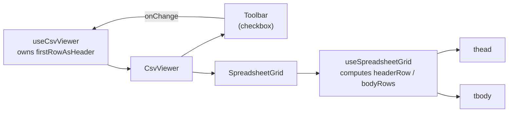

## Design decisions (proceeding with defaults, both questions skipped)

- **Header rendering (wireframe 4 behavior):** when `firstRowAsHeader = true`, keep the A/B/C label row as `<thead>` row 1 (required later for sort arrows in Task 3.2 and filter funnels in Task 4.1). Add a **second sticky row** inside `<thead>` rendering `data[0]` cells with a teal highlight and `H` in the gutter. The tbody renders `data.slice(1)` with row numbers starting at `2`.
- **Toggle placement:** create a stub `Toolbar` component now (matches the task's `Files Involved` list and avoids another CsvViewer refactor when Task 10.1 lands).
- **State ownership:** `firstRowAsHeader` lives in `useCsvViewer` so it can be persisted by Task 10.2 and shared between `Toolbar` and `SpreadsheetGrid`.
- **New hooks convention:** every component gets its own folder with `ComponentName.tsx`, `hooks.ts`, and `index.ts`. Business logic is pushed into the hook; rendering stays thin. Tests target the hook; render tests are minimal.

## File changes

### 1. Refactor `SpreadsheetGrid` to folder-per-component

The existing `[app/components/SpreadsheetGrid.tsx](app/components/SpreadsheetGrid.tsx)` is a flat file and violates the new convention. Convert to:

- `app/components/SpreadsheetGrid/SpreadsheetGrid.tsx` — thin rendering only
- `app/components/SpreadsheetGrid/hooks.ts` — new `useSpreadsheetGrid` with all business logic
- `app/components/SpreadsheetGrid/index.ts` — re-export default

Move the `colLabel`, `MIN_COLS`, `MIN_ROWS` constants and the empty/numCols/numRows math into `hooks.ts`. The styled-components stay in `SpreadsheetGrid.tsx`.

### 2. New `Toolbar` component (stub scope for Task 3.1)

- `app/components/Toolbar/Toolbar.tsx` — renders only the "First row as header" checkbox for now; Task 10.1 will extend with Download / Clear / Delimiter.
- `app/components/Toolbar/hooks.ts` — `useToolbar` wrapping the checkbox change handler (trivial now, but establishes the seam for Task 10.1).
- `app/components/Toolbar/index.ts` — re-export.

Visually match wireframe 4's `[x] First row as header` pill control.

### 3. Update `useCsvViewer` hook

In `[app/components/CsvViewer/hooks.ts](app/components/CsvViewer/hooks.ts)`:

- Add `firstRowAsHeader: boolean` state (default `false`).
- Add `setFirstRowAsHeader: (value: boolean) => void` (or a `toggleFirstRowAsHeader`).
- Expose both on the returned object; extend `UseCsvViewerReturn`.
- Reset to `false` in `handleClear` (keeps behavior consistent; Task 10.2 will later persist it).

### 4. Update `CsvViewer.tsx` to wire Toolbar and SpreadsheetGrid

In `[app/components/CsvViewer/CsvViewer.tsx](app/components/CsvViewer/CsvViewer.tsx)`:

- Render `<Toolbar firstRowAsHeader={viewer.firstRowAsHeader} onFirstRowAsHeaderChange={viewer.setFirstRowAsHeader} />` inside the existing `TopBar` (next to Upload/Clear). The existing ad-hoc Upload/Clear buttons stay until Task 10.1 relocates them into Toolbar.
- Pass `firstRowAsHeader` down: `<SpreadsheetGrid data={viewer.csvData ?? []} firstRowAsHeader={viewer.firstRowAsHeader} />`.

### 5. `SpreadsheetGrid` hook: new business logic

`useSpreadsheetGrid({ data, firstRowAsHeader })` returns a computed view model so the component is dumb:

```ts
interface UseSpreadsheetGridArgs {
  data: string[][];
  firstRowAsHeader: boolean;
}

interface SpreadsheetGridViewModel {
  isEmpty: boolean;
  numCols: number;
  numRows: number;              // count of BODY rows (not incl header)
  bodyRows: string[][];         // data slice shown in <tbody>
  headerRowCells: string[] | null; // data[0] when header on, else null
  rowNumberOffset: number;      // 1 when no header, 2 when header on
  colLabel: (idx: number) => string;
  statusHint: string;
}
```

Key rules the hook encodes:

- When `firstRowAsHeader && data.length > 0`: `headerRowCells = data[0]`, `bodyRows = data.slice(1)`, `rowNumberOffset = 2`.
- When off: `headerRowCells = null`, `bodyRows = data`, `rowNumberOffset = 1`.
- `numCols` computed from the widest row in `data` (including header row) clamped to `MIN_COLS`.
- `numRows` (body) clamped so that header row + body rows >= `MIN_ROWS` for visual consistency with empty state.
- Empty-state hint unchanged when `data.length === 0`.

### 6. `SpreadsheetGrid.tsx` rendering changes

Thin render using the view model:

```tsx
<table>
  <thead>
    <tr>{/* A/B/C label row (always rendered) */}</tr>
    {vm.headerRowCells && (
      <tr data-header-row>
        <HeaderRowGutterTh>H</HeaderRowGutterTh>
        {Array.from({ length: vm.numCols }).map((_, ci) => (
          <HeaderRowTh key={ci}>{vm.headerRowCells![ci] ?? ""}</HeaderRowTh>
        ))}
      </tr>
    )}
  </thead>
  <tbody>{/* vm.bodyRows, row numbers start at vm.rowNumberOffset */}</tbody>
</table>
```

- New styled components `HeaderRowTh` and `HeaderRowGutterTh` with teal background (`#b7f2d8` light / adapted dark variant), bold text, `position: sticky; top: <A/B/C row height>` so the teal row also pins when scrolling.
- Update existing `ColTh` `z-index` stacking so the A/B/C row sits above the teal row.
- Add `--grid-header-row-bg` / `--grid-header-row-text` CSS vars to `[app/globals.css](app/globals.css)` for light + dark.

### 7. Mermaid of the data + control flow




## Tests (per the new guideline: focus on hooks)

Mirror the folder structure under `__tests__/components/`.

- `__tests__/components/SpreadsheetGrid/hooks.test.ts` **(new, primary)**
  - header off: `bodyRows === data`, `headerRowCells === null`, `rowNumberOffset === 1`.
  - header on with non-empty data: `headerRowCells === data[0]`, `bodyRows === data.slice(1)`, `rowNumberOffset === 2`.
  - header on with empty data: returns empty-state shape (no crash, `headerRowCells === null`).
  - `numCols` respects widest row and `MIN_COLS` floor.
  - `colLabel(0) === "A"`, `colLabel(25) === "Z"`, `colLabel(26) === "AA"`.
- `__tests__/components/Toolbar/hooks.test.ts` **(new)**
  - `onFirstRowAsHeaderChange` forwarded correctly when checkbox toggles.
- `__tests__/components/CsvViewer/hooks.test.ts` **(extend existing)**
  - `firstRowAsHeader` defaults to `false`.
  - `setFirstRowAsHeader(true)` updates the returned value.
  - `handleClear` resets `firstRowAsHeader` to `false`.
- `__tests__/components/SpreadsheetGrid/SpreadsheetGrid.test.tsx` **(new, minimal render smoke)**
  - With `firstRowAsHeader=true` and 2+ rows of data, the rendered table contains the header row cells (e.g. `"Name"`) and the body's first row is `data[1]`. One render test is enough per the guideline.
- Move/rename existing flat `__tests__/components/SpreadsheetGrid.test.tsx` if present (none exists currently — only `CsvViewer/`, `UploadModal/`, `Navbar.test.tsx` — so nothing to migrate).

## Verification

1. `npx tsc --noEmit` — clean.
2. `npm test` — all new + existing tests green.
3. `npm run dev` + manual check: toggle the checkbox; row 1 becomes teal sticky header, row numbers start at 2, scrolling keeps both the A/B/C row and the teal row pinned; toggling off restores the original view; Clear resets the toggle.

