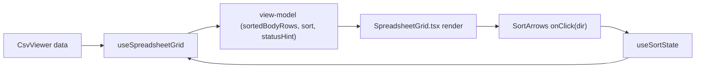

## Context recap

- Task 3.2 (`Module 3 — Header Row & Sorting`) from [TASKS.md](TASKS.md) and row 6 of [tasks.csv](tasks.csv).
- Depends on 3.1 (already done): `firstRowAsHeader` toggle is wired in [app/components/Toolbar/Toolbar.tsx](app/components/Toolbar/Toolbar.tsx) and [app/components/SpreadsheetGrid/SpreadsheetGrid.tsx](app/components/SpreadsheetGrid/SpreadsheetGrid.tsx).
- Wireframe [specs/v0.1/wireframes/2_filter_control_sorting.png](specs/v0.1/wireframes/2_filter_control_sorting.png) + Story 5 in [specs/v0.1/user_stories.md](specs/v0.1/user_stories.md) drive the UX: two arrows on column-letter row (A ▲▼, B ▲▼…), active arrow + column highlighted blue, status bar reads `N rows · Sorted by col B asc`.
- Wireframe 4 confirms the sort arrows stay on the column-letter row (not the teal header-row) even when "First row as header" is on, so the feature is orthogonal to 3.1.

## New architecture guidelines to follow

- Business logic lives in `hooks.ts` per component folder; pure helpers go into `lib/`.
- Component `.tsx` stays thin and mostly renders from a view-model returned by the hook.
- Tests focus on hooks + pure libs. Add RTL render tests only for non-trivial rendering logic (e.g. which cell gets the active class, which arrow shows highlighted).

## 1. Pure sort utilities — `lib/sortUtils.ts` (new)

Exports (all pure, fully unit-testable):

- `type SortDirection = "asc" | "desc"`
- `type ColumnType = "numeric" | "text"`
- `detectColumnType(values: readonly string[]): ColumnType` — returns `numeric` only when every non-empty, trimmed value parses as a finite number via `Number(...)`; otherwise `text`. Empty/whitespace cells are ignored for detection.
- `compareValues(a: string, b: string, type: ColumnType): number` — numeric: compare parsed numbers (empty-string sorts last); text: locale-aware case-insensitive compare; mixed fallback (when numeric detection is off but a value is numeric) goes "numbers before letters in ascending" per Story 5.
- `sortRows(rows: readonly string[][], colIdx: number, direction: SortDirection): string[][]` — returns a new array; stable sort (carry original index); never mutates input.

Example shape:

```ts
export function sortRows(rows, colIdx, direction) {
  const type = detectColumnType(rows.map((r) => r[colIdx] ?? ""));
  const withIndex = rows.map((row, i) => ({ row, i }));
  withIndex.sort((a, b) => {
    const cmp = compareValues(a.row[colIdx] ?? "", b.row[colIdx] ?? "", type);
    if (cmp !== 0) return direction === "asc" ? cmp : -cmp;
    return a.i - b.i;
  });
  return withIndex.map((x) => x.row);
}
```

## 2. Sort state hook — add to [app/components/SpreadsheetGrid/hooks.ts](app/components/SpreadsheetGrid/hooks.ts)

Keep the file-per-component layout. Add a small focused hook and compose it inside `useSpreadsheetGrid`:

- `interface SortState { colIdx: number; direction: SortDirection }`
- `useSortState()` → `{ sort: SortState | null, onArrowClick(colIdx, direction) }`
  - `onArrowClick(colIdx, dir)` logic: if current state matches `{colIdx, dir}` → clear; else set to `{colIdx, dir}`. This matches the user-stories UX ("click active arrow to deselect") and also resets when a new column is clicked (Story 5: "sorting via first column will be reset").
- Extend `computeSpreadsheetGridViewModel(data, firstRowAsHeader, sort)` to:
  - Apply `sortRows(bodyRows, sort.colIdx, sort.direction)` when `sort` is set (header row is excluded from sort because `bodyRows` is already `data.slice(1)` when header is on).
  - Extend `statusHint`: when sorted, return `"${bodyRows.length} rows · Sorted by col ${colLabel(sort.colIdx)} ${sort.direction}"`; otherwise keep current behaviour.
  - Expose `sort` in the returned view-model so the component can highlight the active column + active arrow.
- `useSpreadsheetGrid` composes `useSortState` and memoises the VM on `[data, firstRowAsHeader, sort]`.

The pure function `computeSpreadsheetGridViewModel` stays pure (no React) so unit tests can drive it directly like the existing ones in [__tests__/components/SpreadsheetGrid/hooks.test.ts](__tests__/components/SpreadsheetGrid/hooks.test.ts).

## 3. Rendering — [app/components/SpreadsheetGrid/SpreadsheetGrid.tsx](app/components/SpreadsheetGrid/SpreadsheetGrid.tsx)

- `ColTh` becomes a small container showing `{colLabel} <SortArrows />`.
- `SortArrows` is a tiny presentational piece inside the same file (styled buttons for ▲ and ▼) that takes `{ direction: SortState['direction'] | null, onClick(dir) }`.
- When a column is actively sorted: apply `data-sort-active` on its `ColTh` → new CSS var `--grid-sort-active-bg` (blue, per wireframe 2), the active arrow gets `--grid-sort-active-arrow` color; inactive arrows stay grey.
- Add CSS vars in [app/globals.css](app/globals.css):
  - `--grid-sort-active-bg: #dbeafe;` (light) / deep blue for dark mode
  - `--grid-sort-arrow-idle: #9ca3af;`
  - `--grid-sort-arrow-active: #2563eb;`
- Status bar already reads `vm.statusHint`; no rendering change needed there.

## 4. Tests

Small, hook-centric additions (following the new guideline):

- New `__tests__/lib/sortUtils.test.ts`
  - `detectColumnType`: pure numeric, mixed text, numeric-with-blanks, all-blank → text.
  - `compareValues` for both types incl. locale + blanks-last.
  - `sortRows`: stable order on ties, asc/desc inversion, never mutates input, out-of-range col index safe.
- Extend `__tests__/components/SpreadsheetGrid/hooks.test.ts`
  - VM with `sort = {colIdx: 0, direction: "asc"}` returns sorted `bodyRows`.
  - `statusHint` contains `"Sorted by col A asc"` when sorted; unchanged when not.
  - `useSortState` (via `renderHook`): initial `null`; click ▲ on col 1 → asc on col 1; click ▲ again → null; click ▼ on col 2 after asc-on-1 → desc on col 2 (reset behaviour).
  - Header-on + sort: confirm `bodyRows = sortRows(data.slice(1), …)` and `rowNumberOffset` stays `2`.
- Minimal render test in `__tests__/components/SpreadsheetGrid/SpreadsheetGrid.test.tsx`
  - Clicking ▲ on col B reorders visible cell text.
  - Active column `th` has `data-sort-active` attribute.

## 5. Persist the component/hooks convention as a Cursor rule

So future agents pick the convention up automatically without being told.

- New file: `.cursor/rules/react-component-structure.mdc`
- Frontmatter:
  - `description: React component + custom-hooks layout convention`
  - `globs: app/components/**/*.{ts,tsx}`
  - `alwaysApply: false` (scoped — only fires when touching components)
- Content (concise, <50 lines, with a mini example):
  - Every component lives in its own folder under `app/components/<ComponentName>/` (folder name = component name, or a logical parent name grouping related components).
  - That folder contains:
    - `<ComponentName>.tsx` — rendering only. Reads a view-model from a local hook and wires handlers. No business logic, no side-effects beyond trivial prop-to-DOM mapping.
    - `hooks.ts` — all business logic, state, event handlers, memoised view-model. Pure functions (e.g. `computeXxxViewModel`) are exported alongside the `useXxx` hook so they can be tested without React.
    - `index.ts` — re-exports the component as default and public types.
  - Do NOT create a global `hooks/` folder; colocate hooks with their component.
  - Tests target the hook / pure function first. Add a render test only when rendering has non-trivial conditional logic.
  - Example structure reference: [app/components/SpreadsheetGrid/](app/components/SpreadsheetGrid) and its tests under [__tests__/components/SpreadsheetGrid/](__tests__/components/SpreadsheetGrid).

This task is cheap but high-leverage — it keeps this convention enforced for modules 4–10.

## 6. Out of scope (called out so we don't scope-creep)

- Filter funnel (task 4.1) — arrows only, no filter icon yet.
- Sort arrow shown on the teal header-row — wireframe 4 keeps arrows on column-letter row only.
- Persisting sort state to localStorage — that is task 10.2.
- Multi-column sort — user stories explicitly say single-column with reset on new column.

## Mermaid — data flow after the change



## Touch list

- `lib/sortUtils.ts` (new)
- `app/components/SpreadsheetGrid/hooks.ts` (extend)
- `app/components/SpreadsheetGrid/SpreadsheetGrid.tsx` (render arrows + active styles)
- `app/globals.css` (3 new CSS vars)
- `__tests__/lib/sortUtils.test.ts` (new)
- `__tests__/components/SpreadsheetGrid/hooks.test.ts` (extend)
- `__tests__/components/SpreadsheetGrid/SpreadsheetGrid.test.tsx` (extend)
- `.cursor/rules/react-component-structure.mdc` (new — codify the component + hooks convention)
- `TASKS.md` / `tasks.csv` — flip status of task 3.2 to Done at the end.