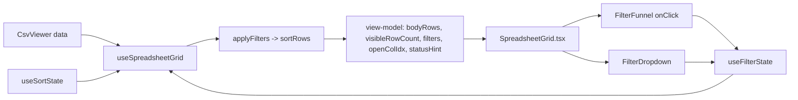

## Context

- Task 4.1 row in [tasks.csv](tasks.csv) and Module 4 in [TASKS.md](TASKS.md). Depends on 3.1 (header row toggle, already done).
- Source of truth for UX: [specs/v0.1/user_stories.md](specs/v0.1/user_stories.md) Story 6, [specs/v0.1/wireframes/2_filter_control_sorting.png](specs/v0.1/wireframes/2_filter_control_sorting.png) (funnel per column, next to sort arrows) and [specs/v0.1/wireframes/4_header_row_filters.png](specs/v0.1/wireframes/4_header_row_filters.png) (`Filter: City` dropdown with search, `[x]` list, `Apply Filter` / `Clear`, status bar `Filter active on City · Showing 3 of 5 rows`).
- Architectural conventions from [.cursor/rules/react-component-structure.mdc](.cursor/rules/react-component-structure.mdc): rendering only in `<Name>.tsx`, business logic + pure `compute*` helpers in `hooks.ts`, `index.ts` barrel, pure libs in `lib/`.
- Decisions confirmed: expanded numeric operators `=, ≠, <, ≤, >, ≥`; multi-column filtering allowed; status bar shows a compact count summary when >1 column is active.

## 1. Pure filter utilities — `lib/filterUtils.ts` (new)

Reuse `detectColumnType` / `parseFiniteNumber` from [lib/sortUtils.ts](lib/sortUtils.ts); no duplication.

```ts
export type NumericOperator = "=" | "!=" | "<" | "<=" | ">" | ">=";

export type ColumnFilter =
  | { kind: "set"; values: Set<string> }
  | { kind: "numeric"; op: NumericOperator; value: number };

export type FilterMap = Record<number, ColumnFilter>;

export function getUniqueValues(rows: readonly string[][], colIdx: number): string[];
export function applyFilters(rows: readonly string[][], filters: FilterMap): string[][];
export function matchesNumericFilter(cell: string, f: Extract<ColumnFilter,{kind:"numeric"}>): boolean;
```

- `getUniqueValues` returns sorted unique trimmed values (empty string included as `"(blank)"` sentinel? — keep as actual empty string; the UI labels it in render).
- `applyFilters` applies every active filter (AND across columns). For `set`, keep row when `row[col]` is in the set. For `numeric`, parse the cell as finite number — non-numeric cells are filtered out (matches intent of "for numeric columns").
- All pure, fully unit-testable, no React.

## 2. Filter state hook — extend [app/components/SpreadsheetGrid/hooks.ts](app/components/SpreadsheetGrid/hooks.ts)

- New `useFilterState()` → `{ filters, openColIdx, openDropdown(col), closeDropdown(), setFilter(col, filter|null) }`.
- Only one dropdown open at a time (`openColIdx: number | null`).
- Extend `UseSpreadsheetGridArgs` / view-model to include:
  - `filters: FilterMap`, `openColIdx`, handlers above
  - `totalRowCount` (pre-filter body count) + `visibleRowCount` (post-filter) for status bar
  - `uniqueValuesFor(colIdx)` + `columnTypeFor(colIdx)` helpers (memoised per-column)
- Update `computeSpreadsheetGridViewModel(data, firstRowAsHeader, sort, filters)`:
  - Pipeline: `data` → body slice (respecting `firstRowAsHeader`) → `applyFilters` → `sortRows` → pad to `MIN_ROWS`.
  - `numRows` uses `Math.max(MIN_ROWS, visibleCount)` (post-filter); gutter numbering stays display-sequential as today.
  - Rebuild `statusHint` composition (keep existing sort message, prepend filter message):
    - 1 filter: `"Filter active on col X · Showing N of M rows"` (use header cell text when `firstRowAsHeader`, else `colLabel`).
    - > 1 filter: `"Filters active on K columns · Showing N of M rows"` (per user's compact choice).
    - When both sort + filter are on, join with `·` so status bar reads e.g. `Filter active on C · Showing 3 of 5 rows · Sorted by col B asc`.

Keep `computeSpreadsheetGridViewModel` pure and exported for unit tests as today.

## 3. `FilterDropdown` component — `app/components/FilterDropdown/` (new folder)

Follow the component convention.

- `FilterDropdown/FilterDropdown.tsx` — rendering only. Props:
  - `title: string` (either header cell text or `"col X"`)
  - `columnType: "numeric" | "text"`
  - `uniqueValues: string[]` (for text)
  - `currentFilter: ColumnFilter | null`
  - `onApply(filter: ColumnFilter | null)` / `onClear()` / `onClose()`
- `FilterDropdown/hooks.ts` — `useFilterDropdown(props)` with `computeFilterDropdownViewModel(...)`:
  - Draft state: for text, `Set<string>` of checked values (defaults to all-checked when no current filter, or current filter's set); for numeric, `{op, value}`.
  - `searchQuery` state; filters `uniqueValues` case-insensitively; `showSearch = uniqueValues.length >= 5`.
  - Handlers: `toggleValue(v)`, `selectAll()`, `clearAll()`, `setOperator(op)`, `setValue(v)`, `apply()`, `clearFilter()`.
  - `apply()` logic: text kind — if draft set equals full set, pass `null` (no filter); numeric kind — require finite value, else disable `Apply`.
  - Returns a view-model the `.tsx` renders directly.
- `FilterDropdown/index.ts` — default export + public types.

Rendering specifics (match wireframe 4):

- Header row inside dropdown: `Filter: {title}`.
- Search input when `showSearch` is true, placeholder "Search values…".
- Checkbox list (scrollable, max-height ~220px); each row renders the value or `(blank)` label for empty strings.
- For numeric: `<select>` of the six operators + `<input type="number">`.
- Footer buttons: `Apply Filter` (primary) and `Clear`.
- Escape / outside-click → `onClose()` (without applying).
- Positioned absolutely under the funnel via CSS `top: 100%; left: 0` inside the `ColTh`; overflow visible from parent header.

## 4. Funnel icon + wiring in `SpreadsheetGrid.tsx`

- New `FilterFunnel` tiny button (styled, next to `<SortArrows />` inside `ColThInner`); aria-label `"Filter column X"`. `data-active="true"` when `filters[ci]` exists — applies `--grid-filter-active` color.
- Click funnel: `vm.openDropdown(ci)` (closes any other open one).
- Render `<FilterDropdown>` inline inside the active `ColTh` when `vm.openColIdx === ci`, wired with:
  - `title` = header cell for col when `firstRowAsHeader` else `colLabel(ci)`
  - `columnType` from `columnTypeFor(ci)` (detects on current body slice)
  - `uniqueValues` from `uniqueValuesFor(ci)`
  - `currentFilter` from `filters[ci] ?? null`
  - `onApply(f)` → `setFilter(ci, f)` + `closeDropdown()`
  - `onClear()` → `setFilter(ci, null)` + `closeDropdown()`
- `ColTh` gets `position: relative` and `overflow: visible` so the dropdown can escape the header; table wrapper is already `overflow: auto` — that's fine because the dropdown lives inside the sticky header (z-index layering: dropdown > 5).

## 5. CSS — [app/globals.css](app/globals.css)

Add a tiny set of vars (light + dark):

- `--grid-filter-icon-idle: #9ca3af`
- `--grid-filter-icon-active: #d97706` (amber funnel per wireframe)
- `--dropdown-bg: var(--background)`
- `--dropdown-border: var(--border)`
- `--dropdown-shadow: 0 8px 24px rgba(0,0,0,0.12)`

## 6. Tests

- `__tests__/lib/filterUtils.test.ts` (new): `applyFilters` with single/multi-col, AND semantics, numeric-op truth table, blank-cell handling; `getUniqueValues` dedupes + preserves order; `matchesNumericFilter` edge cases.
- Extend `__tests__/components/SpreadsheetGrid/hooks.test.ts`: filter pipeline runs before sort; `visibleRowCount` vs `totalRowCount`; statusHint variants (single col, multi col, with + without sort, with + without header row).
- New `__tests__/components/FilterDropdown/hooks.test.ts`: draft state init from current filter, search filtering, `Apply` disabled until valid numeric, all-selected → `null` filter, numeric operator switching.
- New `__tests__/components/FilterDropdown/FilterDropdown.test.tsx`: render mode branches by column type, `Apply` / `Clear` callbacks fire with expected payloads, search box hidden when <5 unique values.
- Extend `__tests__/components/SpreadsheetGrid/SpreadsheetGrid.test.tsx`: clicking funnel opens dropdown; opening a second column's funnel closes the first; row count reduces after applying a set filter.

## 7. Out of scope (explicit)

- Persistence of filters to localStorage — Task 10.2.
- Clear All wiping filters — wired through toolbar in Task 10.1.
- Combining filter + row/column add/delete — Task 8.x.
- "Filter by condition" (contains / starts-with) for text columns — user stories only require value checklist.

## 8. Data flow diagram




## Touch list

- [lib/filterUtils.ts](lib/filterUtils.ts) (new)
- [app/components/SpreadsheetGrid/hooks.ts](app/components/SpreadsheetGrid/hooks.ts) (extend: `useFilterState`, pipeline, statusHint, exports)
- [app/components/SpreadsheetGrid/SpreadsheetGrid.tsx](app/components/SpreadsheetGrid/SpreadsheetGrid.tsx) (resolve merge conflict; add funnel + dropdown mount; `ColTh` `position: relative`)
- `app/components/FilterDropdown/FilterDropdown.tsx` (new)
- `app/components/FilterDropdown/hooks.ts` (new)
- `app/components/FilterDropdown/index.ts` (new)
- [app/globals.css](app/globals.css) (filter icon + dropdown CSS vars)
- `__tests__/lib/filterUtils.test.ts` (new)
- `__tests__/components/FilterDropdown/hooks.test.ts` (new)
- `__tests__/components/FilterDropdown/FilterDropdown.test.tsx` (new)
- **[tests**/components/SpreadsheetGrid/hooks.test.ts](__tests__/components/SpreadsheetGrid/hooks.test.ts) (extend)
- **[tests**/components/SpreadsheetGrid/SpreadsheetGrid.test.tsx](__tests__/components/SpreadsheetGrid/SpreadsheetGrid.test.tsx) (extend)
- [TASKS.md](TASKS.md) + [tasks.csv](tasks.csv) — flip row 7 / Task 4.1 to Done after green `jest` + `eslint`.

