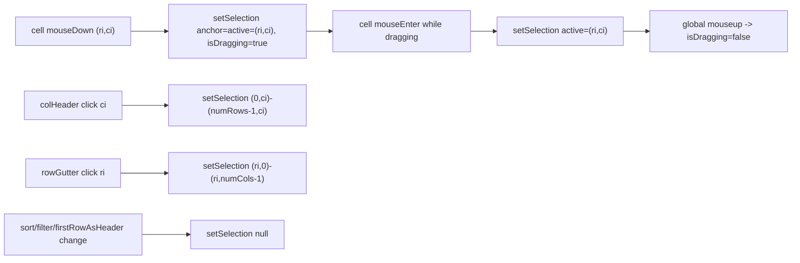

## Task 5.1 — Range Selection

Goal (from `TASKS.md` / wireframe 5): mouse-down sets anchor, drag extends, mouse-up finalises; clicking a column-letter header selects the full column; clicking a row-number gutter selects the full row; selected cells get a blue highlight. Status-bar text like `9 cells selected (B2:D4)` appears at the bottom.

### Design decisions

- **Coordinate space = display space.** Selection is indexed over the currently rendered `bodyRows` (post-sort/filter). When `sort`, `filters`, or `firstRowAsHeader` change, the selection is cleared (stale indices are unsafe). This is the simplest correct semantic and matches the wireframe (visual rectangle).
- **Selection shape = axis-aligned rectangle** stored as `{ anchorRow, anchorCol, activeRow, activeCol } | null`. Bounds are derived by `min/max` at read time (pure helper).
- **Header row (when `firstRowAsHeader=true`) is not selectable** — it lives in `<thead>` and represents metadata. Column selection spans only the body rows.
- **Sort arrows & filter funnel** already `stopPropagation`, so attaching selection handlers to the column `<th>` won't conflict.
- **Drag lifecycle**: React `onMouseDown` on a data cell starts drag; `onMouseEnter` on a cell (only while dragging) extends; a single global `mouseup` listener (attached via `useEffect` while dragging) finalises. Mouse-up outside the grid still finalises.
- **Empty state** (no data) remains non-interactive for selection — empty rendered cells are inert.

### Data-flow diagram

### Files to change

- [app/components/SpreadsheetGrid/hooks.ts](app/components/SpreadsheetGrid/hooks.ts)
  - Add pure helpers (exported for tests):
    - `getSelectionBounds(sel): { top, left, bottom, right } | null` — normalises anchor/active.
    - `isCellSelected(sel, ri, ci): boolean`.
    - `cellRangeLabel(sel, rowNumberOffset): string` — e.g. `B2:D4` (single cell → `B2`). Uses existing `colLabel`.
  - Add `useSelectionState()` hook exposing:
    - `selection`, `isDragging`, `onCellMouseDown(ri, ci)`, `onCellMouseEnter(ri, ci)`, `onColumnHeaderMouseDown(ci)`, `onRowGutterMouseDown(ri)`, `clearSelection()`.
    - Internal `useEffect` attaches `mouseup` to `window` while dragging.
  - Extend `useSpreadsheetGrid` to:
    - Clear selection in a `useEffect` whenever `sort`, `filters`, or `firstRowAsHeader` change (skip first render).
    - Expose new selection fields + handlers on the view model.
    - Append selection text to `statusHint` when selection is non-empty: `"N cells selected (B2:D4)"` (takes priority or appends as a new segment joined by ` · `). Hide row-count/sort text when the only state is a single-cell selection? Keep it simple — always append, after filter/sort segments.
- [app/components/SpreadsheetGrid/SpreadsheetGrid.tsx](app/components/SpreadsheetGrid/SpreadsheetGrid.tsx)
  - `<ColTh>`: add `onMouseDown={() => vm.onColumnHeaderMouseDown(ci)}`. Sort arrows/filter funnel already `stopPropagation`.
  - `<RowTh>`: add `onMouseDown={() => vm.onRowGutterMouseDown(ri)}` and `cursor: pointer`.
  - `<DataTd>`: add `onMouseDown`, `onMouseEnter`, and `data-selected="true"` when `vm.isCellSelected(ri, ci)`. Suppress text selection with `user-select: none` while `vm.isDragging` (set on the wrapper via a data attribute).
  - Keep component free of business rules; only event wiring.
- [app/globals.css](app/globals.css)
  - Add `--grid-selection-bg` (light: `#cfe2ff` / dark: `#1e3a5f`) + a subtle border color token for selection edges if needed. Use it in `SpreadsheetGrid.tsx` via `DataTd[data-selected="true"] { background: var(--grid-selection-bg); }`.

### Tests

- [__tests__/components/SpreadsheetGrid/hooks.test.ts](__tests__/components/SpreadsheetGrid/hooks.test.ts)
  - `getSelectionBounds` normalises reversed anchor/active (drag up-left).
  - `isCellSelected` returns true for cells within bounds, false outside.
  - `cellRangeLabel` returns `B2` for single cell, `B2:D4` for multi, accounts for `rowNumberOffset=2` when header row is active.
  - `useSpreadsheetGrid` clears selection when `sort`, `filters`, or `firstRowAsHeader` changes (use `renderHook` + `rerender`).
- [__tests__/components/SpreadsheetGrid/SpreadsheetGrid.test.tsx](__tests__/components/SpreadsheetGrid/SpreadsheetGrid.test.tsx)
  - Mouse-down on one cell + mouse-enter on another + mouseup ⇒ both cells have `data-selected="true"` and status bar shows range label.
  - Click on column-letter `<th>` ⇒ every cell in that column is selected.
  - Click on row-number `<th>` ⇒ every cell in that row is selected.
  - Clicking the sort-asc button on a column still sorts and does NOT also create a column selection (verifies `stopPropagation` still covers us).

### Out of scope for 5.1 (deferred)

- Numeric aggregations display (Task 6.1).
- Keyboard navigation / shift-click extension (not in spec).
- Copying selection to clipboard.
- Selection serialization to Download-Selected (Task 9.1 will read `selection` from view model).